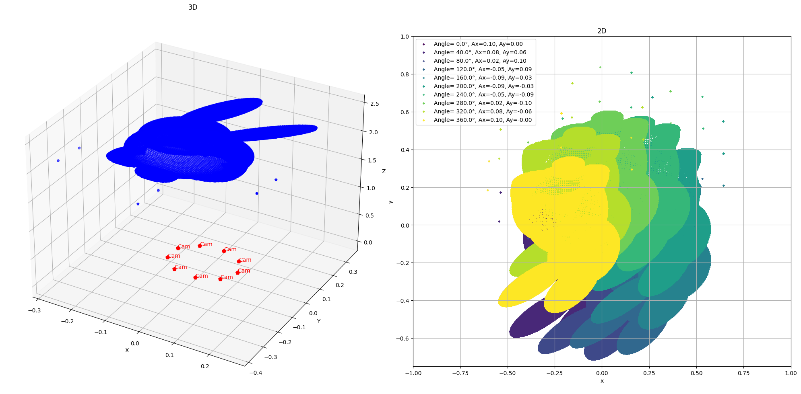

### 3D to 2D Projection Simulation with Camera Movement

This project simulates the process of projecting 3D points onto a 2D plane from multiple camera perspectives. It visualizes both the original 3D points and their corresponding 2D projections, taking into account the movement of a camera around a circular path. The transformation process uses principles from computer graphics, including homogeneous coordinates and perspective projection.
 
Here’s a visualization using this code with 3D rabbit data: 


### Key Concepts Demonstrated:

1. **3D Point Representation**:  
   The code starts by reading a set of 3D points from a CSV file (using **Pandas**) and visualizes them in 3D space using Matplotlib’s 3D plotting capabilities. The points are plotted as blue markers in the 3D plot. Each point is represented by `X`, `Y`, and `Z` coordinates.

2. **Camera Movement**:  
   A virtual camera moves along a circular path in the 2D plane, defined by the parameters `R` (radius) and an angle `θ`. For each angle, the camera's position is calculated, and the camera's projection onto the 3D points is simulated. The camera position is visualized in the 3D plot as red markers.

3. **Homogeneous Coordinates**:  
   The 3D points are converted into homogeneous coordinates, which is a standard technique in computer graphics that allows for more complex transformations, including translation, scaling, and projection, using matrix operations.

4. **Projection to 2D**:  
   The primary operation in this project is the **perspective projection** of 3D points onto a 2D plane. This is done using:
   - A **projection matrix** that accounts for the camera’s focal length and the depth (`z`-coordinate) of the points.
   - **Transformation matrices** for camera position and perspective correction.
   
   The 3D points are then transformed and projected to 2D coordinates, simulating what the points would look like if viewed from the camera’s position.

5. **Transformation Matrices**:  
   - **Translation Matrices**: The camera’s position is updated by translating the 3D points based on the camera's movement along a circle.
   - **Projection Matrix**: The 3D points are projected onto the 2D plane using a matrix that incorporates the camera's focal length (`f`), which simulates how objects appear smaller as they move farther from the camera.
   - **Combining Matrices**: The transformations are applied in sequence to produce the final 2D projections.

6. **Visualization**:  
   Two plots are generated:
   - **3D Plot**: The original 3D points and the camera positions are visualized in 3D space.
   - **2D Plot**: The 2D projections of the 3D points are shown from the perspective of the moving camera. The color of each point corresponds to a different camera angle.

7. **Camera Angles and Projections**:  
   The camera’s circular movement is simulated by iterating through different angles (`θ` from 0 to 2π). For each angle, the 3D points are projected onto the 2D plane, and their new positions are plotted. The camera's position in the 2D plot changes for each iteration, showing how the 3D points' projections shift based on the camera's view.

### Features:
- **3D and 2D Visualization**: Interactive plots showing both 3D and 2D views.
- **Multiple Camera Angles**: Projections are computed from various camera positions along a circular path.
- **Mathematical Transformations**: Uses homogeneous coordinates, translation, and perspective projection to simulate real-world camera transformations.
- **Real-time Updates**: As the camera moves along the circular path, the 2D projections of the 3D points are dynamically updated, showcasing how different viewpoints affect the appearance of 3D objects.

### Requirements:
- **Python 3.x**: This script was developed using Python 3.
- **NumPy**: For numerical operations, especially matrix and array manipulations.
- **Pandas**: For reading and handling 3D point data from a CSV file.
- **Matplotlib**: For plotting 2D and 3D graphs.
- **mpl_toolkits.mplot3d**: For 3D plotting capabilities in Matplotlib.

To install the required libraries, run:
```bash
pip install numpy pandas matplotlib
```

### How to Use:
1. **Prepare the Data**:  
   The code expects a CSV file (`rabbit_pc.csv`) with columns `X`, `Y`, and `Z`, representing the 3D coordinates of the points you wish to project. This file can be any CSV that includes the required columns.

   Example of CSV format:
   ```csv
   X,Y,Z
   0.1,0.2,0.3
   0.4,0.5,0.6
   0.7,0.8,0.9
   ...
   ```

2. **Run the Script**:  
   The script will read the CSV file using **Pandas** (`data = pd.read_csv('rabbit_pc.csv')`) and populate the 3D point data into the `data` DataFrame. The 3D points and their 2D projections will be visualized in the generated plots.

3. **Interact with the Plot**:  
   You can interact with the 3D plot to view the points from different angles. The 2D plot will automatically update based on the camera positions.

### Example Output:
- **3D Plot**: The 3D points are visualized as blue markers in a 3D space, with the camera positions marked in red.
- **2D Projection Plot**: The 2D projection of the points is shown in the 2D plot with varying colors based on the camera’s angle, simulating how the points appear from different viewpoints.

### Possible Extensions:
- **Interactive Camera Control**: Implement interactive controls to move the camera and update the projections dynamically.
- **Real-time Rendering**: Integrate with libraries like OpenGL or Pygame for real-time rendering of 3D scenes.
- **Multiple Cameras**: Simulate multiple cameras at different positions, comparing their projections.
- **Depth of Field**: Implement effects like depth of field to simulate realistic focusing effects.
